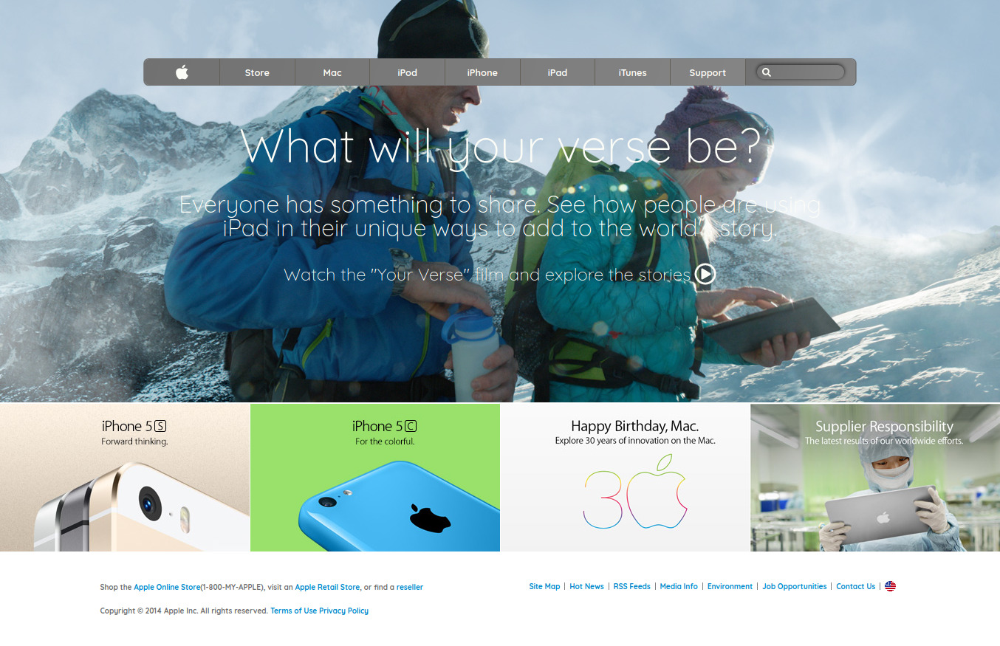

# Project Name

> A clone of apple.com (old)

The goal of this project was to create a similar design to the site (https://web.archive.org/web/20140301004610/http://www.apple.com/) with more emphasis on the use of backgrounds and gradients.

## Built With

- HTML
- CSS

## Live Demo

[Live Demo Link](https://rawcdn.githack.com/misterpaul4/apple-old-website-clone/d9b918350a605783829db951a46071e83b622d16/index.html)

## Authors

👤 **Author1**

- Email: [@gmail](ajuzepaul@gmail.com)
- Github: [@githubhandle](https://github.com/misterpaul4)
- Twitter: [@twitterhandle](https://twitter.com/paulajuze)
- Linkedin: [linkedin](https://www.linkedin.com/in/chukwuebuka-paul-ajuizeogu/)

## 🤝 Contributing

Contributions, issues and feature requests are welcome!

Feel free to check the [issues page](issues/).

## Show your support

Give a ⭐️ if you like this project!

## Acknowledgments

- Hat tip to anyone whose code was used
- Inspiration
- etc

## 📝 License

This project is [MIT](lic.url) licensed.
